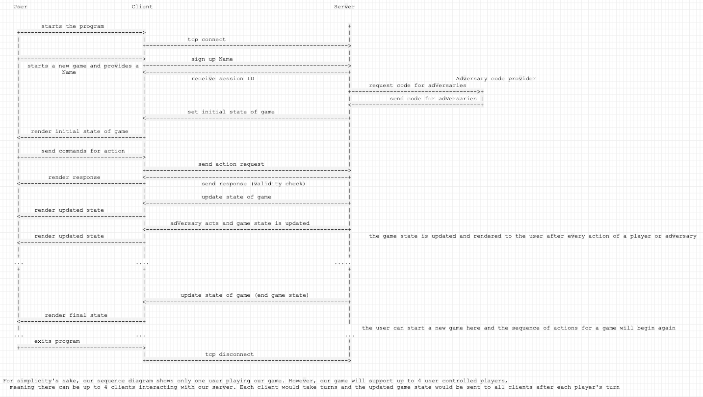

Subject: Implementation plan for Snarl  

Dear Friends at Growl Inc, 

   This memo seeks to outline the software components and data structures required to implement the dungeon crawler game Snarl. This memo assumes that the reader is familiar with the terminology and game play. 
   The implementation will require two main software components, a client and a server. The client will represent the game's graphics and will allow the user to interact with the game. An instance of the client will exist for each registered user. The server will contain all the data structures and describe all the behaviors of the game. The server will also keep track of all instances of the client. Interactions between the user and the client instance will be communicated continuously to the server component throughout the game.The server will check the validity of any actions/moves a user tries to make . The server will communicate back to each client any changes in the game, including moves or actions by other Players or Adversaries.  After receiving information from the server, each client will in turn update the game play and prompt the user to interact, if it is their turn. This communication will be explored in more depth both later in this memo and in the accompanying UML diagram.  
   The server will contain the logics and structures needed to support the game. The main data structures, referred to as classes as our implementation will be in Java, are Players, Adversaries, Collectables, Rooms, Tiles, Dungeon. The Dungeon class will describe the current level and contain an array of Rooms, an array of Players, an array of Adversaries, the turn number, and the level number. The Dungeon will also have a number indicating which Player or Adversary will act next. The Room class will contain an array of arrays of Tiles, representing the floor of the room, and any Players or Adversaries in the Room. Each Tile class will contain information on if it is occupied and by what. A Tile could be Occupied by a Player, a Collectable, or an Adversary. A Collectable contains information on what kind of Collectable it is. The most interesting classes are of course the Player and the Adversary.  
   Each Player will have a Name, the number the player joined, a Location (containing the Room and Tile), an array of visible Tiles, an array of Collectables indicating its Inventory, and information on whether it has acted on a particular turn and whether or not it has been expelled. Information on attack points and health could also be included in the Player class. A Player’s position and the visible Tiles determine what graphics are displayed to the User through the client. Each Adversary will have information on what type of adversary it is, its location, whether it has been expelled or not, and whether or not it has acted in a particular turn.  
   Adversaries are similar to Players in structure, but differ in behavior. Adversaries are automated, and have a set way they react to their neighboring Tiles (and their occupants). These set actions are defined by a third party server, which our server will query at the beginning of the game. After receiving a request, the server will send back code defining how each Adversary acts for the entirety of the game. In contrast, the Player’s actions are determined by the user. When it is their turn, the user will indicate the desired action to the client, which will communicate the details back to the server. The server will then update the game play, and send the updated information back to the client. The server will also, at this stage, either run the given code to perform Adversary’s action or request a move from the client instance associated with the next user.  
   From this sequence of communication, it becomes apparent that there is common knowledge that both the server and all client instances will need to know at all points in the game play. This information will include the level number, the turn number, the number indicating who’s turn it is, the position of the players and adversaries.  
   We the implementers hope you at Growl Inc. find this outline of Snarl satisfactory. Please let us know if you have any questions or comments on our design. 
 
Best regards, 
	Megan Larson & Jalaj Singh 
 

