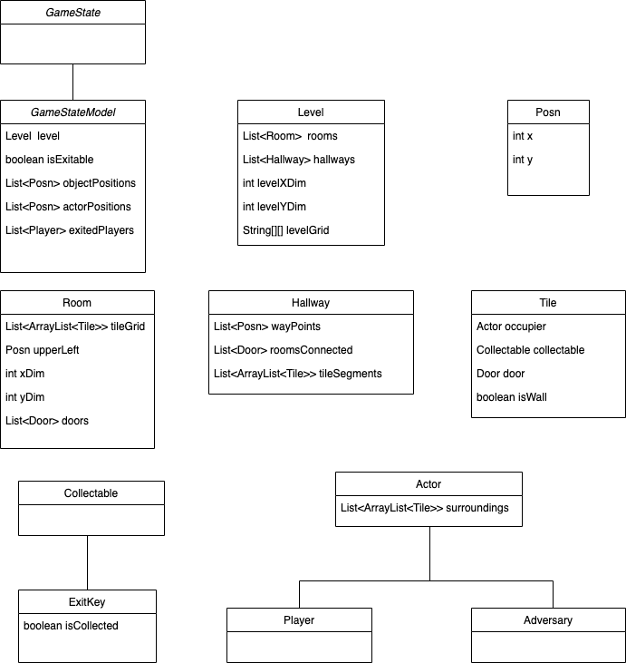

Dear friends at Growl Inc, 

The following memo contains information on the behaviors and fields in a Snarl GameState. A GameState is a representation of the current time-slice of the game. A GameState is a private field of the GameManager, but other components, such as players and adversaries, can query information from the GameState when relevant. The behaviors defined the GameStateInterface and implemented in the GameStateClass are as follows: 
* Void setLevel(Level newLevel):
  * Level object is created by random level generator in GameManager
  * Also resets all the other fields according to the generated Level
* Boolean validMove(Player player, Location destination)
  * Method determines if a player can move to the given location
  * A move is valid if the tile is unoccupied/un-walled and near enough
* Boolean isGameComplete()
  * Checks if all players are still in the game and that none have exited
  * Calls endGame()
* Void movePlayer(Player player, Location destination)
  * Moves a specific player to desired location
  * Calls validMove() before running the logics of the move, then calls updateGame()
* Void updateGame()
  * Calls isGameComplete()
  * Updates and rerenders the level with the newest data
* Void endGame()
  * Returns to the gameManager that game is done and the conditions that resulted in game finishing (loss/win) 

Other components, such as the GameManager, will need to call these methods to advance the game. Along with the implementations of these methods, the GameStateClass will have the following fields:  
* Level Object
* Boolean isExitable representing if the exit door can be reached
* Map of Actor Objects to Posn
* Map of Collectable Objects to Posn
* List of Ejected Actors  
See the included diagram for more information on the Objects mentioned in the GameStateClass fields.  
Warm regards,  
	Jalaj Singh & Megan Larson  

